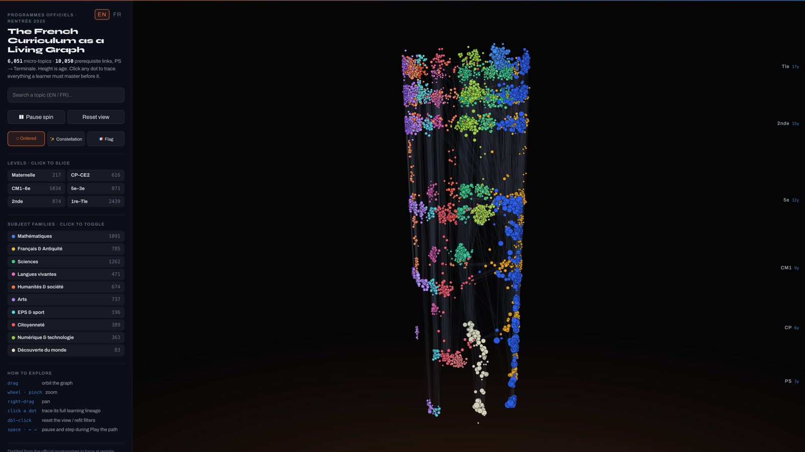
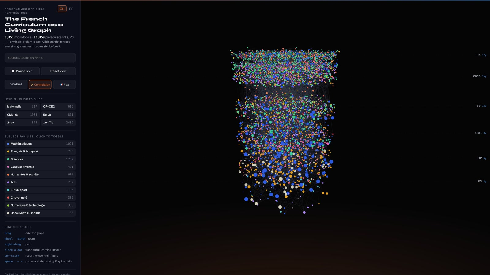
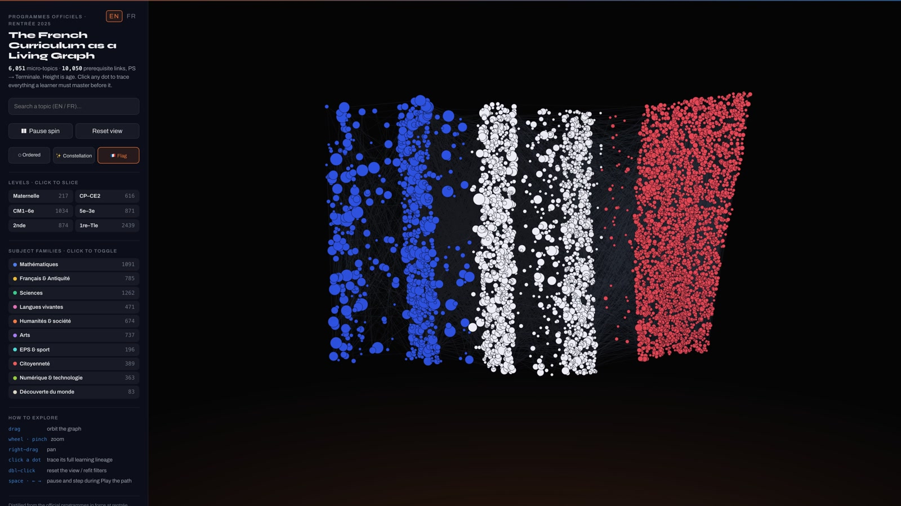
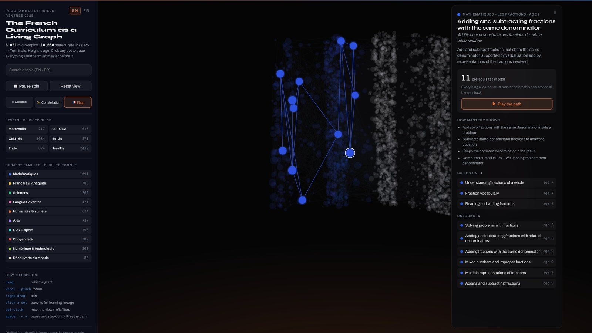

# os-taxonomy-fr

An open, structured taxonomy of **what children learn in France**, from école maternelle (age 3) to Terminale (age 18): the official programmes decomposed into fine-grained micro-topics, wired into a prerequisite graph, and aligned to the source curriculum standards.

The French sibling of Marble's [os-taxonomy](https://github.com/withmarbleapp/os-taxonomy) (US/UK curricula), schema-compatible by design.

> **Version:** `v1-fr` · **Topics:** 6,051 · **Prerequisite edges:** 10,050 · **Source standards:** 14,549 · **Scope:** voie générale, programmes in force at rentrée 2025

## See it

**[Explore the interactive 3D graph](https://www.migueltorrez.ai/projects/french-curriculum)** — every dot a micro-topic, height is age, threads are prerequisites. Click any concept to trace everything a learner must master before it, play the path chronologically, or morph the whole curriculum into a constellation or a waving tricolore. Bilingual EN/FR interface. A self-contained copy of the same viewer ships in this repo as `viewer.html` (no dependencies, works offline).

| Ordered | Constellation | Flag |
|---|---|---|
|  |  |  |



## What this is

Most curriculum data is either a flat list of standards or locked inside a product. This dataset is a **connected graph of learning**:

- **6,051 micro-topics** (`data/fr-topics.json`) — a single teachable idea each (e.g. *"Adding fractions with the same denominator"*), with an English name and description, a French name (`nameFr`), a type (conceptual / procedural / representational / language / meta), subject and domain, an age range, observable mastery-evidence bullets, and links to the standards it was distilled from.
- **10,050 prerequisite edges** (`data/fr-dependencies.json`) — a verified directed acyclic graph: *"topic X depends on prerequisite Y"*, tagged `hard`/`soft`, each with a one-line reason.
- **14,549 curriculum standards** (`data/fr-curriculum-standards.json`) — the raw material, extracted **verbatim** from the official texts and grouped into 17 curriculum families, each standard carrying its subject, domain heading, grade levels, kind (attendu / compétence / connaissance / capacité / objectif / repère), page locator and Bulletin officiel reference.
- **845 domain clusters** (`data/fr-clusters.json`) — parent-friendly one-paragraph summaries per (subject, domain, age band).
- **Full provenance** (`data/sources.json`) — the 127 verified official source documents with URLs, direct PDFs, BO references and in-force status.

### Subjects

42 subjects across 10 families: Mathématiques (945 topics), Français (650), SVT, Physique-chimie, langues vivantes, histoire-géographie, philosophie, the 13 lycée spécialités, the optional layer (DGEMC, LCA, arts…), EMC/EMI/EVARS, EPS, and the maternelle learning domains. Counts per subject are in `data/fr-manifest.json`.

## Files

| File | What it holds |
|---|---|
| `data/fr-topics.json` | Micro-topics (graph nodes), EN + FR names |
| `data/fr-dependencies.json` | Prerequisite edges (verified DAG) |
| `data/fr-curriculum-standards.json` | Verbatim source standards, 17 curricula |
| `data/fr-clusters.json` | Parent-friendly domain summaries |
| `data/fr-manifest.json` | Counts + SHA-256 checksums |
| `data/sources.json` | The 127 verified official source documents |
| `schema/` | JSON Schemas (Marble-compatible; topics extended with `nameFr`) |
| `viewer.html` | The self-contained interactive 3D viewer (no dependencies, works offline) |
| `viewer-template.html` | The same viewer with no data baked in, for building your own |
| `scripts/inject_viewer_data.py` | Injects a graphdata payload into the template |
| `.claude/skills/` | The `build-curriculum-taxonomy` agent skill (see below) |
| `index.html` | Redirect to the live viewer at [migueltorrez.ai](https://www.migueltorrez.ai/projects/french-curriculum) |
| `METHODOLOGY.md` | Precisely how this was built |

## How it was built

Three days of orchestrated AI-agent pipelines (~1,700 agent runs) with deterministic code enforcing every global constraint: verbatim extraction with adversarial verification against the source pages, embedding-gated deduplication with judge panels, strict prerequisite proposal plus adversarial refutation, and code-enforced acyclicity. The guiding principle: **agents propose, code disposes**. The complete account, including honest limitations, is in [`METHODOLOGY.md`](METHODOLOGY.md).

## Build your own (any country)

This repo ships an agent skill that turns the whole pipeline into a reusable recipe: [`.claude/skills/build-curriculum-taxonomy/SKILL.md`](.claude/skills/build-curriculum-taxonomy/SKILL.md). Clone the repo, open it in [Claude Code](https://claude.com/claude-code) (or hand the SKILL.md to any capable agent), and ask it to build a taxonomy for your country. The skill walks through all seven phases: locking scope, corpus hunting past anti-bot walls, verbatim extraction with fidelity verification, micro-topic atomization with embedding-gated dedup, adversarial prerequisite refutation with code-enforced acyclicity, clusters, and rendering your own dataset into the included data-free viewer (`viewer-template.html` + `scripts/inject_viewer_data.py`). The schemas in `schema/` and the data files here serve as the worked example.

## Using the data

Everything is plain UTF-8 JSON. Quick start:

```python
import json
topics = json.load(open("data/fr-topics.json"))["topics"]
deps   = json.load(open("data/fr-dependencies.json"))["dependencies"]

by_id = {t["id"]: t for t in topics}
edge  = deps[0]
print(by_id[edge["topicId"]]["name"], "depends on",
      by_id[edge["prerequisiteId"]]["name"], f"({edge['strength']}: {edge['reason']})")
```

The schemas match Marble's os-taxonomy (topics add an optional `nameFr`), so tooling built for one dataset works on both.

## En français

Une taxonomie ouverte et structurée de ce que les élèves apprennent en France, de la petite section à la Terminale : les programmes officiels décomposés en 6 051 micro-notions, reliées par 10 050 liens de prérequis (graphe acyclique vérifié), alignées sur 14 549 exigences extraites mot pour mot des textes officiels en vigueur à la rentrée 2025 (voie générale). Chaque notion porte un nom français et anglais, une tranche d'âge et des signes de maîtrise ; chaque exigence renvoie à son document source et à sa référence au Bulletin officiel. Le visualiseur interactif ([en ligne](https://www.migueltorrez.ai/projects/french-curriculum) ou `viewer.html`, interface FR/EN) permet de remonter la filiation complète de n'importe quelle notion. La méthode complète est décrite dans `METHODOLOGY.md`.

## Licensing

- **Official curriculum text** (the verbatim standards and any quoted programme content): reproduced under the [Licence Ouverte / Open Licence v2.0](https://www.etalab.gouv.fr/licence-ouverte-open-licence/) (Etalab). Source: Ministère de l'Éducation nationale, Bulletin officiel de l'éducation nationale. References per document in `data/sources.json`.
- **Everything else** (topics, dependencies, clusters, schemas, viewer, documentation): [MIT](LICENSE).

## Credits

- **Ministère de l'Éducation nationale** — the official programmes this is distilled from.
- **[Marble](https://withmarble.com)** — the os-taxonomy structure and the visualization concept this project deliberately mirrors for France.
- Built by [Miguel Torrez](https://www.migueltorrez.ai) with orchestrated AI-agent pipelines.
